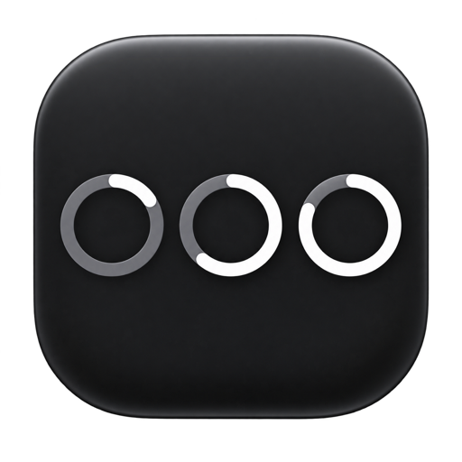
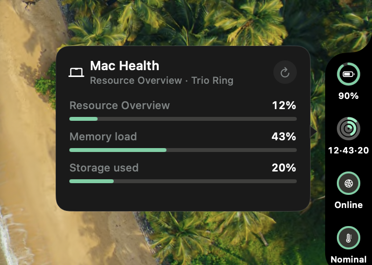

<p align="center">
  
</p>

<h1 align="center">Iles</h1>

<p align="center">
  Pin watch-style complications to the edge of your Mac.
</p>

<p align="center">
  
</p>

Each island is a stack of rings, values, and statuses you compose from AI
quotas, sessions, calendar, Mac health, focus, git, and service checks. There
is no Dock icon. Nothing leaves this machine unless you turn a source on.

[Download 0.1.0-beta.2](https://github.com/basique-industrie/iles/releases)
for macOS 26 (universal).
[CI](https://github.com/basique-industrie/iles/actions/workflows/ci.yml)
· [Releases](https://github.com/basique-industrie/iles/releases)

## Install

1. [Download the latest release](https://github.com/basique-industrie/iles/releases).
2. Unzip it and move **Iles.app** to **Applications**.
3. Open **Iles**. Islands appear on the screen edge.

A new install starts empty. The edge plus opens Settings — the island editor,
recipe catalog, and source setup. A one-shot hint sits beside the plus until
you click it. Starter collections add coherent stacks for AI, Mac health,
coding focus, day planning, shipping, or service monitoring.

The notarized zip is signed. A local `scripts/package.sh` build is **Iles Dev**:
ad-hoc, a different bundle ID, and isolated settings so it can run next to
`/Applications/Iles.app`.

## Workspace

- Multiple independent islands on either edge of any connected display
- Nine families: ring, dual ring, value, status, activity, countdown, trend,
  summary, and trio ring
- Per-element data, used or remaining, tint, label, and click action
- More than 135 recipes; a recipe appears only when its source has the metrics
- Local extensions trusted by content fingerprint — no marketplace, no
  automatic update

## Catalog

- **AI** — quota used or remaining, health, reset countdowns, burn pace, and
  cost for supported providers
- **Sessions** — Claude Code state, project, duration, tasks, agents, and
  recent sessions
- **Time** — clock and period progress, Calendar, meeting progress, free time,
  and Reminders
- **Mac** — battery, CPU, memory, storage, network, thermal state, low-power
  mode, and uptime
- **Focus** — an app-owned focus and break timer, daily goal, sessions, and
  streak
- **Developer** — local Git plus GitHub Actions, pull requests, reviews, and
  deployments through an existing `gh` login
- **Services** — HTTP status, latency, availability, and failure count

AI sources include Claude, Codex, Gemini, Antigravity, Z.ai, Copilot, Amp, Kimi,
Kiro, Cursor, MiniMax, DeepSeek, Vercel, Alibaba, Mistral, OpenCode, OpenCode
Mobile, and Grok.

See [Extension manifest v2](docs/extension-manifest-v2.md) to add a local
source.

## Build from source

macOS 26 SDK and a Swift 6.2 toolchain:

```bash
./scripts/run.sh
```

That packages and opens **Iles Dev** (`dist/Iles Dev.app`). Leave the GitHub
**Iles.app** in Applications if you want both running.

| Command | Purpose |
| --- | --- |
| `./scripts/run.sh` | Live probes in Iles Dev |
| `./scripts/run.sh --demo` | Deterministic demo values |
| `./scripts/test.sh` | Regression and security suites |
| `./scripts/check-public-release.sh` | Public-release hygiene |
| `./scripts/package.sh` | Ad-hoc `dist/Iles Dev.app` |
| `./scripts/package.sh --shipped` | Ad-hoc `dist/Iles.app` |
| `./scripts/release.sh` | Signed, notarized zip from a matching tag |

## Local data

| Data | Shipped Iles | Iles Dev |
| --- | --- | --- |
| Settings | `~/.iles/settings.json` | `~/.iles-dev/settings.json` |
| Extensions | `~/.iles/extensions/` | `~/.iles-dev/extensions/` |
| Redacted logs | `~/Library/Logs/Iles/` | `~/Library/Logs/Iles-Dev/` |
| App credentials | Keychain `com.jean.iles.credentials` | Keychain `com.jean.iles.dev.credentials` |
| Claude hook | `__iles_hook` in `~/.claude/settings.json` | `__iles_dev_hook` in the same file |

Network activity is limited to enabled provider and service sources.

## Documentation

| Document | Audience and scope |
| --- | --- |
| [Architecture](ARCHITECTURE.md) | Module boundaries and reliability controls |
| [Release](docs/RELEASE.md) | Versioning, signing, notarization, and publication |
| [Extension manifest v2](docs/extension-manifest-v2.md) | Local source schema and trust |
| [Contributing](CONTRIBUTING.md) | Change workflow and documentation expectations |
| [Privacy](PRIVACY.md) | Data processed on the Mac and required-reason APIs |
| [Security](SECURITY.md) | Trust boundaries and reporting |
| [Third-party notices](THIRD_PARTY_NOTICES.md) | Runtime, provider marks, and generated artwork |

## License and trademarks

Code is available under the [MIT License](LICENSE). Provider names and logos
belong to their respective owners and identify compatibility only. Integrations
are community-maintained and are not affiliated with those vendors. Some AI
sources read a vendor CLI's local state or an undocumented endpoint; those
sources can change or stop without notice.
