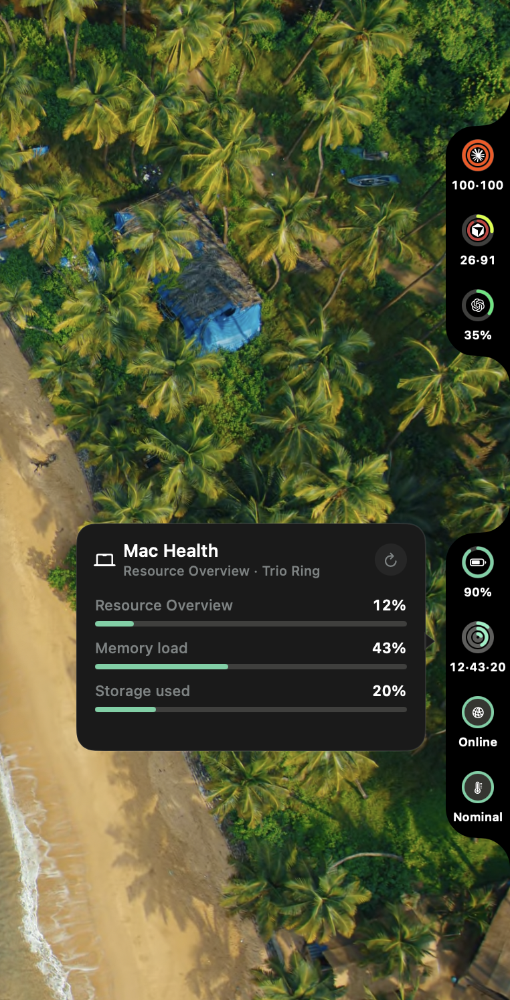

<p align="center">
  
</p>

<h1 align="center">Iles</h1>

<p align="center">
  A local-first, watch-style complication workspace for macOS.
</p>

<p align="center">
  <a href="https://github.com/basique-industrie/iles/releases"></a>
</p>

<p align="center">
  <a href="https://github.com/basique-industrie/iles/actions/workflows/ci.yml"></a>
  <a href="https://github.com/basique-industrie/iles/releases"></a>
</p>

<p align="center"><strong>macOS 26 or newer · Universal</strong></p>

Iles builds compact edge islands from AI usage, coding activity, time and
calendar, Mac health, focus, repositories, shipping status, service health, and
trusted local extensions. It has no Dock icon: the islands sit on the screen
edge, and **Settings…** opens the editor.

The current public line is `0.1.0-beta.1`.

<p align="center">
  
</p>

Provider integrations are community-maintained and are not affiliated with
their respective vendors. Some AI usage sources read an installed vendor CLI's
local state or use an undocumented endpoint; those sources can change or stop
working without notice.

## Requirements

- macOS 26 or newer

The notarized release is a universal `Iles.app` (`arm64` and `x86_64`). Local
ad-hoc builds from `scripts/package.sh` follow the machine you build on.

## What it does

Iles:

- places multiple independent islands on either screen edge and any connected
  display;
- renders nine visual families: ring, dual ring, value, status, activity,
  countdown, trend, summary, and trio ring;
- lets every complication element choose its own data, used or remaining
  presentation, tint, label, and click action;
- ships more than 135 curated recipes across AI, sessions, time, Mac, focus,
  developer, and services;
- shows a recipe only when its source exposes the required metrics — setup-
  dependent sources never display invented values;
- keeps usage data on this Mac, with no analytics, advertising, or telemetry;
- trusts local extensions by content fingerprint, without a marketplace or
  automatic update.

The default workspace is one right-edge island with Claude, Codex, and Cursor
rings. Starter collections add coherent stacks for AI, Mac health, coding
focus, day planning, shipping, or service monitoring.

## Install

1. [Download the latest release](https://github.com/basique-industrie/iles/releases).
2. Unzip it and move **Iles.app** to **Applications**.
3. Open **Iles**. Islands appear on the screen edge; there is no Dock icon.

The first public artifacts are signed and notarized. A local
`scripts/package.sh` build is ad-hoc signed and is for development only.

**Settings…** opens the island editor, searchable complication catalog, source
setup, general settings, and About.

## Build from source

On a Mac with the macOS 26 SDK and a Swift 6.2 toolchain:

```bash
./scripts/package.sh
cp -R dist/Iles.app /Applications/
open /Applications/Iles.app
```

Useful commands:

| Command | Purpose |
| --- | --- |
| `./scripts/run.sh` | Live probes |
| `./scripts/run.sh --demo` | Deterministic demo values |
| `swift test` | Regression and security suites |
| `./scripts/check-public-release.sh` | Public-release hygiene |
| `./scripts/package.sh` | Ad-hoc `dist/Iles.app` |
| `./scripts/release.sh` | Signed, notarized zip from a matching tag |

## Catalog

- **AI** — quota used or remaining per ring, quota health, reset countdowns,
  burn pace, and cost or budget values for supported providers.
- **Sessions** — Claude Code state, project, duration, tasks, agents, and recent
  sessions.
- **Time** — clock and period progress, Calendar events, meeting progress, free
  time, and Reminders.
- **Mac** — battery, CPU, memory, storage, network, thermal state, low-power
  mode, and uptime.
- **Focus** — an app-owned focus and break timer, daily goal, sessions, and
  streak.
- **Developer** — local Git state plus GitHub Actions, pull requests, reviews,
  and deployments through an existing `gh` login.
- **Services** — configurable HTTP endpoint status, latency, availability, and
  failure count.

AI sources include Claude, Codex, Gemini, Antigravity, Z.ai, Copilot, Amp, Kimi,
Kiro, Cursor, MiniMax, DeepSeek, Vercel, Alibaba, Mistral, OpenCode, OpenCode
Mobile, and Grok.

See [Extension manifest v2](docs/extension-manifest-v2.md) to build a local
source. There is intentionally no public extension marketplace.

## Local data

| Data | Location |
| --- | --- |
| Settings | `~/.iles/settings.json` |
| Extensions | `~/.iles/extensions/` |
| Redacted logs | `~/Library/Logs/Iles/` |
| App credentials | Keychain service `com.jean.iles.credentials` |
| Claude hook | marked entry in `~/.claude/settings.json` |

Network activity is limited to enabled provider and service sources.

## Documentation

| Document | Audience and scope |
| --- | --- |
| [Architecture](ARCHITECTURE.md) | Module boundaries and reliability controls |
| [Release](docs/RELEASE.md) | Versioning, signing, notarization, and publication |
| [Extension manifest v2](docs/extension-manifest-v2.md) | Local source schema and trust |
| [Contributing](CONTRIBUTING.md) | Change workflow and documentation expectations |
| [Privacy](PRIVACY.md) | Data processed on the Mac and required-reason APIs |
| [Security](SECURITY.md) | Trust boundaries and reporting |
| [Third-party notices](THIRD_PARTY_NOTICES.md) | Runtime, provider marks, and generated artwork |

## License and trademarks

Code is available under the [MIT License](LICENSE). Provider names and logos
belong to their respective owners and identify compatibility only.
